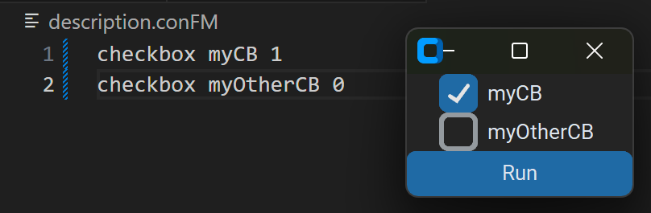
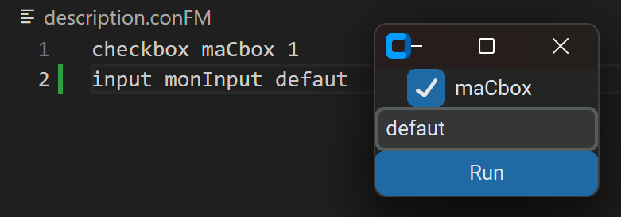
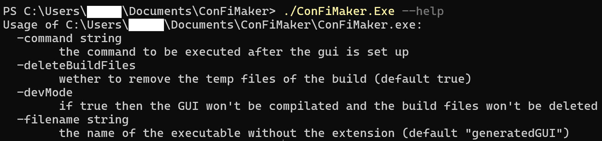

# ConFiMaker

**ConFiMaker** stands for *Configuration File Maker*. This is a tool to create simple GUI that you can add to any development. It is useful when you want your programm to be customizable.

## Requirements

- Go 1.23.5 (used to read the description file and write the python GUI)
- python 3.12 (used to create the GUI with customtkinter (`pip install customtkinter`))
- pyinstaller (used to compile le GUI (`pip install pyinstaller`))

## How to use

### Step 1 - build the project

make sure to build the project with this command `go build .`.

### Step 2 - configure the `description.conFM` file

You have to describe what your GUI will looks like.

#### Available components

- checkbox
- input/entry
- button
- slider

#### Checkbox

If you want to use a checkbox you have to define it this way:

    checkbox nameOfTheAttribute defaultValue

where:

`checkbox` is the type of the widget you want

`nameOfTheAttribute` is the name of the attribute that will be display in the GUI and given as argument to the program you want to start

`defaultValue` is the default value of the checkbox `0` unchecked, `1` checked

#### Input/Entry

If you want to use an entry you have to define it this way:

    entry nameOfTheAttribute defaultValue

where:

`entry` is the type of the widget you want (can be either `entry` or `input`)

`nameOfTheAttribute` is the name of the attribute that will be display in the GUI and given as argument to the program you want to start

`defaultValue` is the default value of the input

### Step 3 - create a GUI

execute the generated executable `ConFiMaker.exe` in the terminal of your choice with the arguments needed.

`./ConFiMaker.exe [options]`

#### Available options

### Step 4 - Execute your GUI

run the GUI executable. Customize the settings you created then click the button to validate, it will run the programm or command you gave your GUI.
