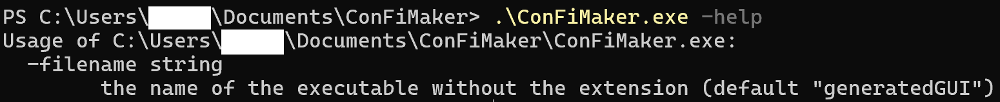

# ConFiMaker

**ConFiMaker** stands for *Configuration File Maker*. This is a tool to create simple GUI that you can add to any development. It is useful when you want your programm to be customizable.

## Requirements

- Go 1.23.5 (used to read the description file and write the python GUI)
- python 3.12 (used to create the GUI with customtkinter (`pip install customtkinter`))
- pyinstaller (`pip install pyinstaller`)

## How to use

### Step 1 - build the project

make sure to build the project with this command `go build .`.

### Step 2 - configure the `description.conFM` file

You have to describe what your GUI will looks like.

#### Available components

- checkbox
- input/entry
- button
- slider

#### Available components options

TODO

### Step 3 - create a GUI

execute the generated executable `ConFiMaker.exe` in the terminal of your choice with the arguments needed.

`./ConFiMaker.exe [options].

#### Available options

### Step 4 - Execute your GUI

run the GUI executable. Customize the settings you created then click the button to validate, it will run the programm or command you gave your GUI.
