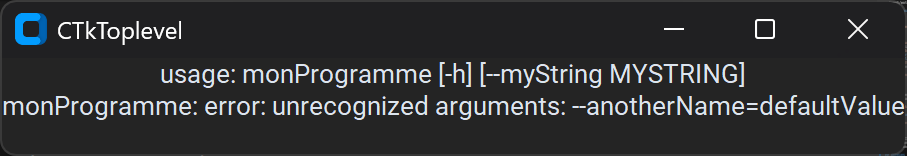

# ConFiMaker

**ConFiMaker** stands for *Configuration File Maker*. This is a tool to create simple GUI that you can add to any development. It is useful when you want your programm to be customizable.

## Requirements

- Go 1.23.5 (used to read the description file and write the python GUI)
- python 3.12 (used to create the GUI with customtkinter (`pip install customtkinter`))
- pyinstaller (used to compile the GUI (`pip install pyinstaller`))

## How to use

### Step 1 - build the project

make sure to build the project with this command `go build .`.

### Step 2 - configure the `description.conFM` file

You have to describe what your GUI will looks like.

#### Available components

- checkbox
- input/entry

#### Syntax

The syntax is the following:

`widgetName label defaultValue`

where:

- `widgetName` can be `checkbox`, `input` or `entry`
- `label` is the name that will be displayed in the GUI. **`label` Must be named the same way that the matching arg from the program ([example](#example-label-naming))**.
- `defaultValue`, when used with `input` or `entry` must be a valid boolean value.


### Step 3 - create a GUI

execute the generated executable `ConFiMaker.exe` in the terminal of your choice with the arguments needed.

`./ConFiMaker.exe [options]`

#### Available options

- **command** string
    the command to be executed after the gui is set up
- **deleteBuildFiles**
    wether to remove the temp files of the build (default true)
- **filename** string
    the name of the executable without the extension (default "generatedGUI")
- **noCompil**
    if true then the GUI won't be compilated

### Step 4 - Execute your GUI

run the GUI executable. Customize the settings you created then click the button to validate, it will run the programm or command you gave your GUI.

## Annexes

### Example Label Naming

consider the following program:

```python
[omited code]
parser.add_argument("--myString")
[omited code]
```

In your `description.conFM` you should do this:

```conFM
input myString defaultValue
```

and you shouldn't do:

```conFM
input anotherName defaultValue
```

Because it will trigger an error

